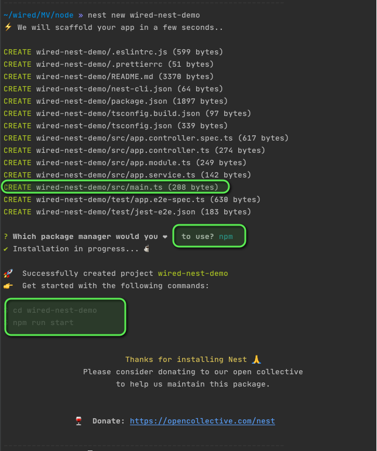
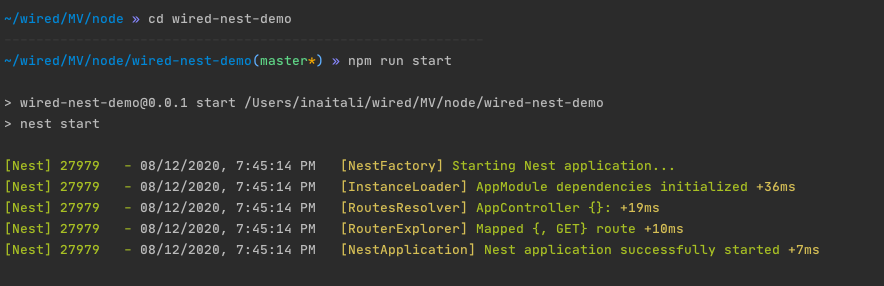
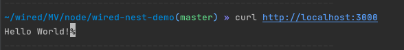
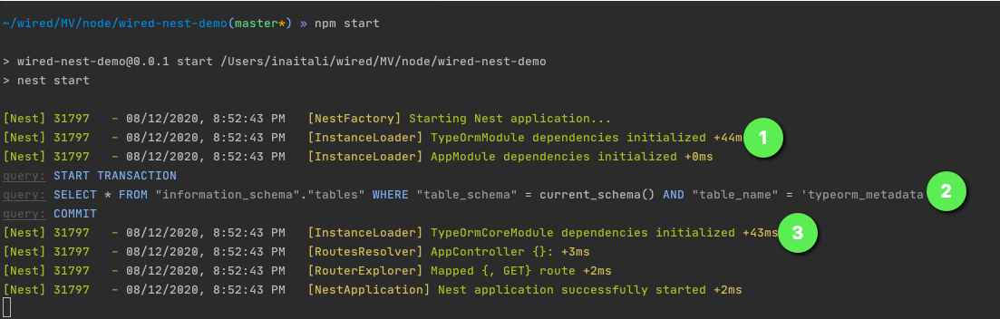
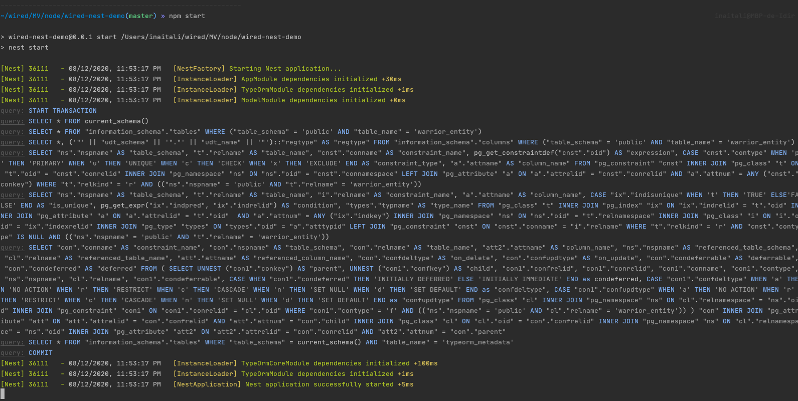

<p align="center">
  <a href="http://nestjs.com/" target="blank"></a>
</p>

[travis-image]: https://api.travis-ci.org/nestjs/nest.svg?branch=master
[travis-url]: https://travis-ci.org/nestjs/nest
[linux-image]: https://img.shields.io/travis/nestjs/nest/master.svg?label=linux
[linux-url]: https://travis-ci.org/nestjs/nest
  
  <p align="center">A progressive <a href="http://nodejs.org" target="blank">Node.js</a> framework for building efficient and scalable server-side applications, heavily inspired by <a href="https://angular.io" target="blank">Angular</a>.</p>
    <p align="center">
<a href="https://www.npmjs.com/~nestjscore"></a>
<a href="https://www.npmjs.com/~nestjscore"></a>
<a href="https://www.npmjs.com/~nestjscore"></a>
<a href="https://travis-ci.org/nestjs/nest"></a>
<a href="https://travis-ci.org/nestjs/nest"></a>
<a href="https://coveralls.io/github/nestjs/nest?branch=master"></a>
<a href="https://gitter.im/nestjs/nestjs?utm_source=badge&utm_medium=badge&utm_campaign=pr-badge&utm_content=body_badge"></a>
<a href="https://opencollective.com/nest#backer"></a>
<a href="https://opencollective.com/nest#sponsor"></a>
  <a href="https://paypal.me/kamilmysliwiec"></a>
  <a href="https://twitter.com/nestframework"></a>
</p>
  <!--[](https://opencollective.com/nest#backer)
  [](https://opencollective.com/nest#sponsor)-->

## Demo

#### 1. Init the project
- Install nest cli:
```shell script
npm install -g @nestjs/cli
```

- Init the nest project using command: `nest new <your-project-name>`:



- Start the node service using npm/yarn inside the created project:



- Using 3 commands line we have operational node service listening on port `3000` serving `hello-word` resource as example:



### 2. Add database config

- Add [docker-compose.yml](docker-compose.yml)
- Install npm [pg](https://www.npmjs.com/package/pg), [typeorm](https://www.npmjs.com/package/typeorm) and [nestjs/typeorm](https://www.npmjs.com/package/@nestjs/typeorm)
- Add a database config in [app.module.ts](src/app.module.ts) using ` TypeOrmModule.forRoot({...})`:
````typescript
    ...
    imports: [
        TypeOrmModule.forRoot({
          type: 'postgres',
          host: 'localhost',
          port: 5432,
          username: 'user',
          password: 'pass',
          database: 'nest',
          autoLoadEntities: true,
          synchronize: true,
          // logging: 'all',
          cli: {
            migrationsDir: 'db.migration',
            entitiesDir: 'src/entities',
          },
        }),
       ...
      ],
    ...
````



#### 3. Create our warriors api

- Models
    - Add model module
     ```shell script
      nest g mo model
     ```
    - Create interface [Warrior](src/model/warrior.interface.ts)
    ```shell script
      nest g cl model/warrior.entity
    ```
    - Create entity [WarriorEntity](src/model/warrior.entity.ts)
    ```shell script
      nest g interface model/warrior
    ```
    and then import it in the current module as `TypeOrmModule` an export it as `TypeOrmModule.forFeature([...])` in [warriors.module.ts](src/warriors/warriors.module.ts)


