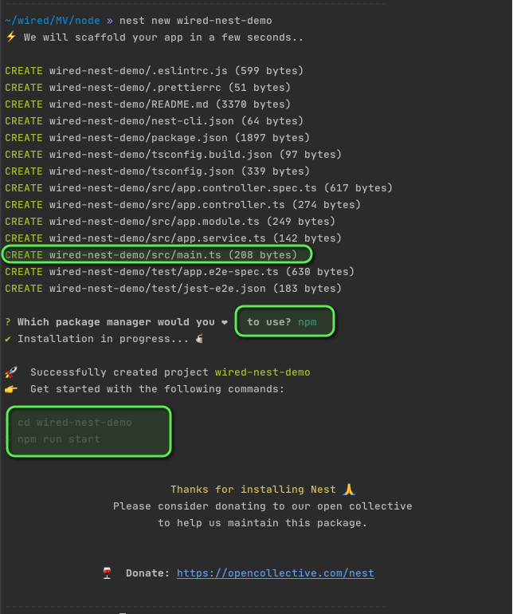
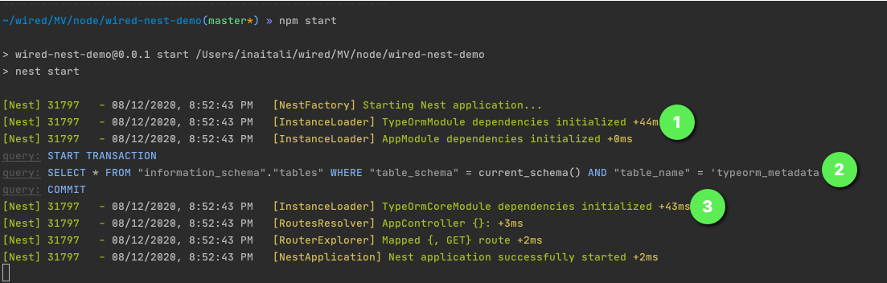

## Warriors microservices with [NestJs](https://github.com/nestjs/nest)

Create complete microservice with database 🤩 😎  using NestJs


### Init the project

- Install nest cli:

```shell script
npm install -g @nestjs/cli
```

- Init the nest project using command: `nest new <your-project-name>`:



- Start the node service using npm/yarn inside the created project:


- Using 3 commands line we have operational node service listening on port `3000` serving `hello-word` resource as
  example:


### 1. Add database config

- Add [docker-compose.yml](docker-compose.yml)
- Install npm [pg](https://www.npmjs.com/package/pg), [typeorm](https://www.npmjs.com/package/typeorm)
  and [nestjs/typeorm](https://www.npmjs.com/package/@nestjs/typeorm)
- Add a database config in [app.module.ts](src/app.module.ts) using ` TypeOrmModule.forRoot({...})`:

````typescript
    ...
imports: [
  TypeOrmModule.forRoot({
    type: 'postgres',
    host: 'localhost',
    port: 5432,
    username: 'user',
    password: 'pass',
    database: 'nest',
    autoLoadEntities: true,
    synchronize: true,
    // logging: 'all',
    cli: {
      migrationsDir: 'db.migration',
      entitiesDir: 'src/entities',
    },
  }),
  ...
],
...
````



### 2. Create our data models

- Add model module
     ```shell script
      nest g mo model
     ```
- Create interface [Warrior](src/model/warrior.interface.ts)
    ```shell script
      nest g cl model/warrior.entity
    ```
- Create entity [WarriorEntity](src/model/warrior.entity.ts)
    ```shell script
      nest g interface model/warrior
    ```
  and then import it in the current module as `TypeOrmModule` an export it as `TypeOrmModule.forFeature([...])`
  in [warriors.module.ts](src/warriors/warriors.module.ts)


### 3. Create our warriors api

- DTOs
    - Add dto module
    ```shell script
      nest g mo dto
    ```
    - Create [WarriorDto](src/dto/warrior.dto.ts)
    ```shell script
      nest g cl dto/warrior.dto
    ```
- Services & Repositories
    - Add service module
    ```shell script
      nest g mo service
    ```
    - Create [WarriorsService](src/service/warriors.service.ts)
    ```shell script
      nest g s service/warriors.srvice
    ```
    - Make the service injectable using nest `@Injectable` and inject a warrior repository using
      nest `@InjectRepository(WarriorEntity)` on the service constructor
    ```typescript
    @Injectable()
    export class WarriorsService {  
  
      constructor(@InjectRepository(WarriorEntity) private readonly warriorsRepository: Repository<WarriorEntity>) {
      }
      ...
    }
    ```
    - Code the business logics

- Controllers
    - Add controller module
    ```shell script
      nest g mo controller
    ```
    - Create [WarriorsController](src/controller/warriors.controller.ts)
    ```shell script
      nest g co service/warriors.controller
    ```
    - Inject the service in the created controller and code the endpoints
    - Add params validation using pipe transformers
    - Add request body validation using library [class-validator](https://github.com/typestack/class-validator#readme),
      see [DTOs](src/dto/warrior.dto.ts)
      

### 4. Logs

- Add [nestjs-pino](https://www.npmjs.com/package/nestjs-pino)
- Add/imports logger config on [app.module.ts](/src/app.module.ts) using ` LoggerModule.forRoot({...ptions})`
- Inject loggers on classes using  `@InjectPinoLogger(MyClass.name)` and the use `this.log.<level>(...)` to log.
  
    - Json log example:
    ```json
    {
      "level":"error",
      "time":1598616886642,
      "pid":20277,
      "hostname":"MBP-de-Idir",
      "req":{
        "id":5,
        "method":"POST",
        "url":"/api/v1/warriors",
        "headers":{
          "host":"localhost:3000",
          "connection":"keep-alive",
          "content-length":"51",
          "accept":"application/json",
          "user-agent":"Mozilla/5.0 (Macintosh; Intel Mac OS X 10_15_6) AppleWebKit/537.36 (KHTML, like Gecko) Chrome/84.0.4147.125 Safari/537.36",
          "content-type":"application/json",
          "origin":"http://localhost:3000",
          "sec-fetch-site":"same-origin",
          "sec-fetch-mode":"cors",
          "sec-fetch-dest":"empty",
          "referer":"http://localhost:3000/api/",
          "accept-encoding":"gzip, deflate, br",
          "accept-language":"fr-FR,fr;q=0.9,en-US;q=0.8,en;q=0.7"
        },
        "remoteAddress":"::1",
        "remotePort":49853
      },
      "context":"WarriorsController",
      "message":"Failed to create a warrior",
      "detail":{
        "response":{
          "statusCode":400,
          "message":"Pseudo 'string' already exist",
          "error":"Cannot create warrior"
        },
        "status":400,
        "message":"Pseudo 'string' already exist"
      }
    }
    ```

### 5. Swagger

- Add [nestjs-swagger](https://www.npmjs.com/package/@nestjs/swagger)
  and [swagger-ui-express](https://www.npmjs.com/package/swagger-ui-express)
- Add swagger config on [main.ts](/src/main.ts)
    ```typescript
      const options = new DocumentBuilder()
          .setTitle('Warriors API documentation')
          .setDescription('The cats API description')
          .setVersion('1.0')
          .build();
        const document = SwaggerModule.createDocument(app, options);
        SwaggerModule.setup('api', app, document);
    ```
- Add documentation:
    - DTOs fields doc: `@ApiProperty({ ...options })`
    - Request parameters doc: `@ApiParam({ name: 'id', type: 'number' })`
    - Request and response body will be automatically documented
    - Controllers doc:
        - `@ApiTags('warriors')` to tag ours warriors controller
        - `@ApiCreatedResponse({ ...options })`, `@ApiBadRequestResponse({ ...options })`... for response case
          documentations
        - ....
        - The Swagger UI will be served here: http://localhost:3000/api when the app started
          

### 6. Middleware for request trace id

- Create the middleware using
  ```shell script nest g mi middleware/TraceId
  ```
  and add the logic handling request to extract the trace id from each request header to put it on response header (
  creating a new one when missing), see [TraceIdMiddleware](/src/middleware/trace-id.middleware.ts).
- Configure the app to use this middleware by implementing `NestModule#configure`) in [AppModule](src/app.module.ts)

```typescript
export class AppModule implements NestModule {
  configure(consumer: MiddlewareConsumer) {
    consumer
      .apply(TraceIdMiddleware)
      .forRoutes(WarriorsController);
    //.forRoutes('warriors'); 
    //.forRoutes({ path: 'warriors', method: RequestMethod.GET });
    //.forRoutes({ path: 'war*', method: RequestMethod.ALL });
    //.exclude(
    //     { path: 'warriors/xxx', method: RequestMethod.GET },
    //     { path: 'warriors', method: RequestMethod.POST },
    //     'warriors/(.*)',
    //)
  }
}
 ```

Request with trace id   


Request without trace id, will create one   


### 7. Exception filter

- Create the http exception filter
  ```shell script nest g f filter/http-exception
  ```
  and add the logic handling http exception, see [HttpExceptionFilter](/src/filter/http-exception.filter.ts)

- Configure the app to use this exception filter by adding in [main.ts](src/main.ts):

```typescript
  ...
app.useGlobalFilters(new HttpExceptionFilter());
...
```

or can apply the filter on a specifics endpoints using `@UseFilters(HttpExceptionFilter)`.

Before:

````json
 {
  "statusCode": 404,
  "message": "Warrior with id '123' does not exist",
  "error": "Not found"
}      
````

After:

````json
 {
  "errors": [
    {
      "code": "err.warrior-not-found",
      "message": "Warrior with id '123' does not exist",
      "detail": "Not found"
    }
  ],
  "error_reference": "Warrior=35e6a491-cd46-4457-bec6-557731077005-f926365d-ed3f-4f2c-9107-08ead2deb933"
}      
````

### 8. Custom decorators

- We create decorator [@ApiKey](/src/decorator/api-key.decorator.ts) to intercept apiKey from request header easily.
  When used, it will try to extract apiKey from request header and throw exception when missing or not valid
  (don't start with given group). Used in [WarriorsController#create()](/src/controller/warriors.controller.ts)
- Used like `myMethod(.., @ApiKey('W-group') apiKey: string, ...)`
- When missing apiKey header

```json
 {
  "errors": [
    {
      "code": "err.unauthorized",
      "message": "Missing apiKey header"
    }
  ],
  "error_reference": "Warrior=7ce09606-6ad9-4809-8f44-cffb2e378538-780cf5f8-2cac-4b01-b30d-74a6a62f1451"
}       
```

- When got apiKey header not allowed

```json
 {
  "errors": [
    {
      "code": "err.not-allowed",
      "message": "Operation not allowed for api key group"
    }
  ],
  "error_reference": "Warrior=125dd729-5ab1-457e-bf6d-c26293863a60-3e6cba3c-2356-4fe3-bcb0-c2f81e79e0c0"
}
```

- Will let pas and map the apiKey header when got a valid one

### 9. Health check

- Install [@nestjs/terminus](https://www.npmjs.com/package/@nestjs/terminus)
- Create [HealthCheckController](/src/controller/health-check/health-check.controller.ts) controller

```shell script
  nest g co  controller/healthCheck
```

and code the health strategy check, using the nest predefined indicators:

- HealthCheckService
- DNSHealthIndicator
- TypeOrmHealthIndicator
- MemoryHealthIndicator
- DiskHealthIndicator:
  or [implement a custom one](https://docs.nestjs.com/recipes/terminus#custom-health-indicator)
- Import the `TerminusModule` into [ControllerModule](src/controller/controller.module.ts)
- The exposed health check endpoint: http://localhost:3000/health
- Example when service health check `UP`

````json
 {
  "status": "ok",
  "info": {
    "warrior.com": {
      "status": "up"
    },
    "google": {
      "status": "up"
    },
    "database": {
      "status": "up"
    },
    "memory_rss": {
      "status": "up"
    },
    "memory_heap": {
      "status": "up"
    },
    "storage_threshold": {
      "status": "up"
    },
    "storage_thresholdPercent": {
      "status": "up"
    }
  },
  "error": {
  },
  "details": {
    "warrior.com": {
      "status": "up"
    },
    "google": {
      "status": "up"
    },
    "database": {
      "status": "up"
    },
    "memory_rss": {
      "status": "up"
    },
    "memory_heap": {
      "status": "up"
    },
    "storage_threshold": {
      "status": "up"
    },
    "storage_thresholdPercent": {
      "status": "up"
    }
  }
}
````

- Example when service health check `DOWN`

```json
        {
  "status": "error",
  "info": {
    "google": {
      "status": "up"
    },
    "storage_thresholdPercent": {
      "status": "up"
    }
  },
  "error": {
    "warrior.com": {
      "status": "down",
      "message": "Request failed with status code 503",
      "statusCode": 503,
      "statusText": "Service Unavailable"
    },
    "database": {
      "status": "down"
    },
    "memory_rss": {
      "status": "down",
      "message": "Used rss exceeded the set threshold"
    },
    "memory_heap": {
      "status": "down",
      "message": "Used heap exceeded the set threshold"
    },
    "storage_threshold": {
      "status": "down",
      "message": "Used disk storage exceeded the set threshold"
    }
  },
  "details": {
    "google": {
      "status": "up"
    },
    "storage_thresholdPercent": {
      "status": "up"
    },
    "warrior.com": {
      "status": "down",
      "message": "Request failed with status code 503",
      "statusCode": 503,
      "statusText": "Service Unavailable"
    },
    "database": {
      "status": "down"
    },
    "memory_rss": {
      "status": "down",
      "message": "Used rss exceeded the set threshold"
    },
    "memory_heap": {
      "status": "down",
      "message": "Used heap exceeded the set threshold"
    },
    "storage_threshold": {
      "status": "down",
      "message": "Used disk storage exceeded the set threshold"
    }
  }
}
```
